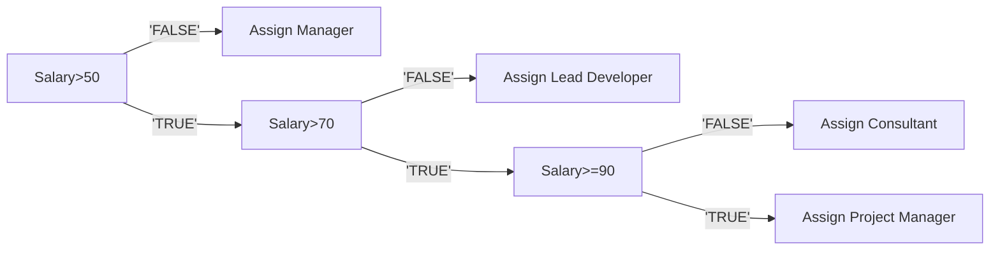

# Prerelease Material
## Hanna Gao

### Task1
1.1 JSP diagrams clealy presents the hierarchy and types of data, which enables the programer to design the program efficiently.

1.2 "*" means repetition; the circle means selections. These will outline the structure of program clearly.

1.3 
IdentifyRole=TRUE
Salary > 50
Salary >=90
ProjectManager
LeadDeveloper
Manager 

1.4

1.5
IF Salary > 50
> THEN 
> > IF Salary >70
> >> THEN
> >>> IF Salary >=90
> >>>> THEN 
> >>>>> Role<-- ProjectManager

> >>>>ELSE
> >>>>>Role<--Consultant

>>>>ENDIF

>>>ELSE
>>>>Role<--LeadDeveloper
>
>>ENDIF
>ELSE
>>Role<--Manager
>
ENDIF

1.6
def IdentifyRole(Salary):
>if salary>50:
>>if salary>70:
>>>if salary >=90:
>>>>return projectmanager
>>>
>>>else:
>>>>return consultant
>>>
>>else:
>>>return leaddeveloper
>
>else:
>>return manager
